# Proyectos Experimentales

Este repositorio es mi espacio personal de aprendizaje, practica y crecimiento.
Aqui documento metas y proyectos sobre distintas areas que quiero explorar para volverme una persona mas independiente, curiosa y capaz de construir soluciones reales.

## Proposito

Usar este repositorio como laboratorio de experimentacion para:
- Aprender haciendo.
- Convertir conocimientos teoricos en proyectos concretos.
- Crear una base escalable de ideas que pueda mejorar con el tiempo.

## Metas

- Adquirir conocimiento tecnico de forma progresiva y constante.
- Desarrollar proyectos que evolucionen por etapas.
- Fortalecer mi capacidad para investigar, resolver problemas y crear por cuenta propia.
- Construir un historial de trabajo que refleje mi crecimiento.

## Proyectos Actuales

### 1. Desarrollo de videojuegos con Godot

Durante este ano, una de mis prioridades es enfocarme en desarrollo de videojuegos usando Godot.
La idea es aprender desde fundamentos hasta la construccion de sistemas jugables mas completos.

### 2. Proyecto final: Dragon Ball

Como parte del enfoque en videojuegos, quiero desarrollar un proyecto final inspirado en Dragon Ball.
Este proyecto me servira para integrar lo aprendido y practicar:
- Diseno de mecanicas.
- Programacion de gameplay.
- Organizacion y escalabilidad del proyecto.

### 3. Exploracion en Telecomunicaciones

Tambien estoy interesado en aprender sobre Telecomunicaciones, area en la que quiero profundizar a futuro.
Este repositorio tambien funcionara como apoyo para registrar avances, ideas y posibles proyectos relacionados.

## Vision a Futuro

Seguir agregando proyectos relacionados con tecnologia y desarrollo personal que me ayuden a:
- Ser mas autonomo al trabajar.
- Mantener una mentalidad de aprendizaje continuo.
- Expandir mis conocimientos en distintas disciplinas tecnicas.

## Roadmap de Proyectos

---

Este README ira evolucionando junto con mis proyectos y metas.